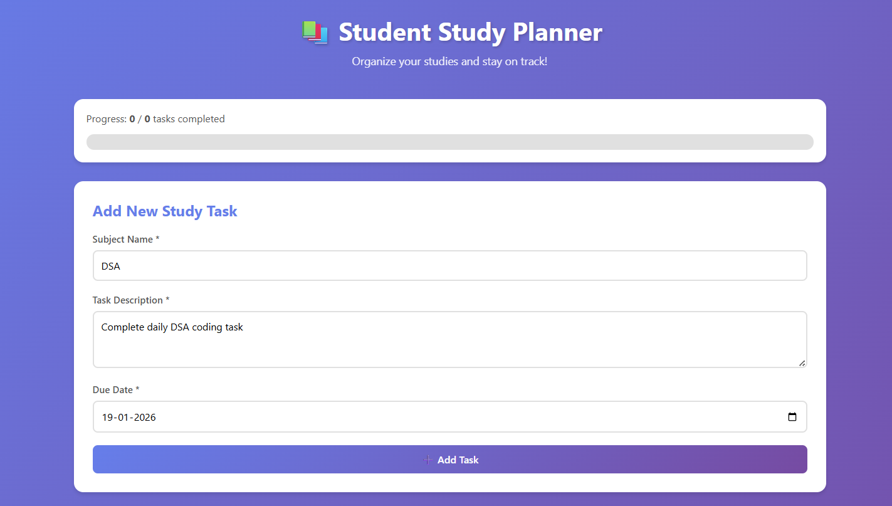
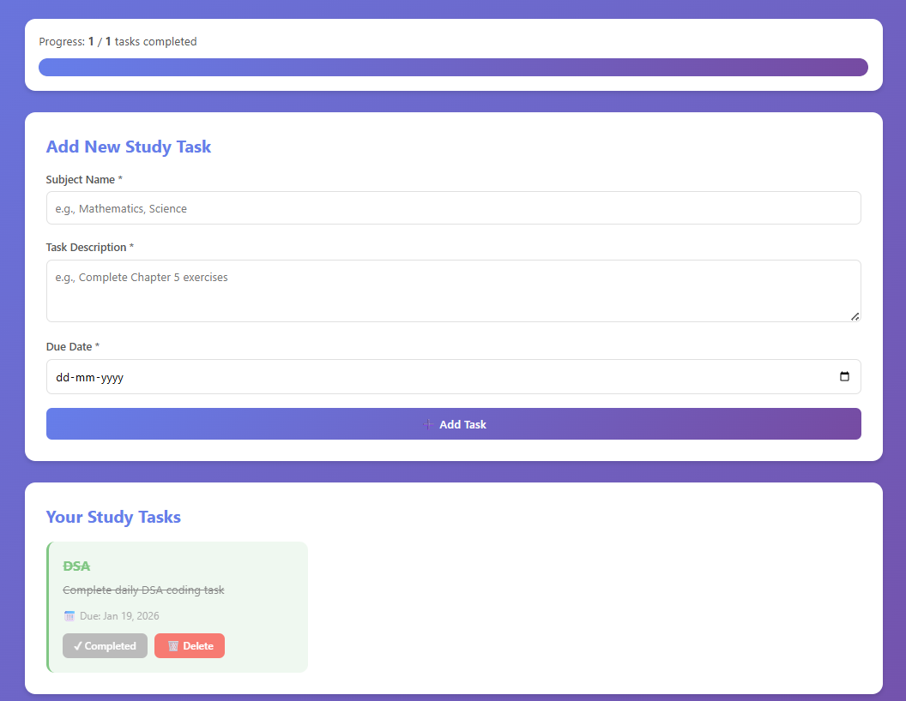

# 📚 Student Study Planner Web Application

A modern, responsive, and user-friendly **Student Study Planner** web app built using **HTML, CSS, and JavaScript**.  
This application helps students **organize their study tasks**, track progress, and complete daily assignments effectively.  

---

## ✨ Features

- **Add Tasks:** Add tasks with subject, description, and due date  
- **Task List:** View tasks in a clean card-based layout  
- **Mark Completed:** Track progress visually with completed tasks  
- **Delete Tasks:** Remove tasks when finished or unnecessary  
- **LocalStorage:** Data persists after refreshing the browser  
- **Responsive Design:** Works perfectly on desktop and mobile  
- **Progress Tracker:** See completed vs total tasks at a glance  
- **Future-ready Design:** Minimalist, soft colors, rounded cards, modern fonts  

---

## 🖼 Screenshots

**Home / Task List**



**Adding a Task**


**Task Completed / Progress Tracker**



---

## 📝 Example Task (Testing)

| Date       | Subject | Task Description                 | Status       |
|-----------|--------|---------------------------------|-------------|
| 19-Jan-2026 | DSA    | Complete daily DSA coding task  | In Progress |

**Testing Steps:**

1. Add a task with subject, description, and due date  
2. Verify the task appears in the task list  
3. Mark the task as completed → UI updates  
4. Delete a task → UI updates and LocalStorage clears it  
5. Refresh page → Ensure tasks persist  
6. Test edge cases: empty task, multiple tasks, completed progress

---

## 🚀 How to Run

1. Clone the repository:

```bash
git clone https://github.com/MahekShikalgar2/student-study-planner.git
